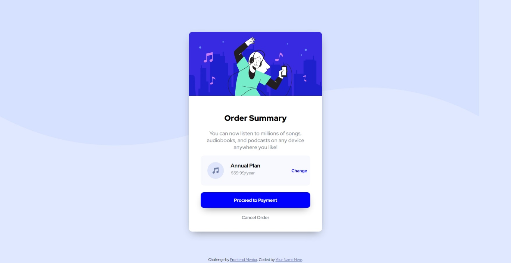

# Frontend Mentor - Order summary card solution

This is a solution to the [Order summary card challenge on Frontend Mentor](https://www.frontendmentor.io/challenges/order-summary-component-QlPmajDUj).

## Table of contents

- [Overview](#overview)
  - [The challenge](#the-challenge)
  - [Screenshot](#screenshot)
  - [Links](#links)
- [My process](#my-process)
  - [Built with](#built-with)
  - [What I learned](#what-i-learned)
  - [Continued development](#continued-development)
  - [Useful resources](#useful-resources)
- [Author](#author)

## Overview

### The challenge

I should be able to:

- See hover states for interactive elements

### Screenshot

### Links

- Live Site URL: [live site URL](https://3omeed.github.io/order-summary-card/)

## My process

### Built with

- Semantic HTML5 markup
- CSS custom properties
- Flexbox
- Mobile-first workflow
- [Styled Components](https://styled-components.com/) - For styles

### What I learned

I learned more experience in the web design as I finish challenges like this, I feel more powerful and improving as I finish these tasks

### Continued development

I want in the future to practice more on the responsive part, and on the color combination of the outlayers in the project

## Author

- LinkedIn - [Abdelrahman Emad](https://www.linkedin.com/in/abdelrahman-emad-57bb10237/)
- Frontend Mentor - [@3omeed](https://www.frontendmentor.io/profile/3omeed)
